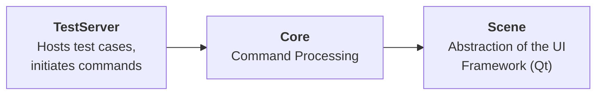

# Spix Library Architecture

This document outlines the architecture of the Spix library, a tool designed for testing and automating Qt/QML applications.

## High-Level Overview

At its core, Spix can be conceptualized into three main components:



*   **TestServer:** This component controls the flow of the test and gets the test commands into Spix. Different implementations can be swapped in depending on how tests are driven.
    *   Spix currently provides two main `TestServer` implementations:
        *   The base `TestServer` class itself provides a C++ API, suitable for controlling tests directly from C++ code, such as within unit tests.
        *   `AnyRpcServer` inherits from `TestServer` and adds an RPC layer (XML-RPC), allowing tests to be controlled remotely by external scripts or test runners.
    *   Users of the library are free to create their own `TestServer` implementations to integrate with different control mechanisms.
*   **Core:** This represents the central command processing logic. It receives commands initiated by the `TestServer`, manages their execution, and dispatches the required actions to the `Scene`.
    *   In the detailed architecture, this corresponds primarily to the `CommandExecuter`, the individual `Command` objects, and the driving logic within `QtQmlBot`.
    *   **Important:** The Core and TestServer components are deliberately designed to be UI framework-agnostic. They should never contain code that depends on a specific UI framework like Qt.
*   **Scene:** This component acts as the bridge to the underlying UI framework (currently Qt). It provides a standardized interface (`Scene` and `Item` base classes) through which commands dispatched by the Core can interact with the UI - manipulating widgets/items, querying properties, and retrieving information about what is shown on screen.
    *   The standard implementation uses `QtScene` and `QtItem` for Qt/QML applications.
    *   Users could potentially adapt Spix to other UI frameworks by providing alternative implementations of the `Scene` and `Item` interfaces without needing to modify the TestServer or Core components.
    *   All UI framework-specific code is isolated within the Scene implementation, ensuring the rest of Spix remains framework-agnostic.

## Command Flow and Execution

The Spix library employs a command pattern to decouple the test instruction's initiation from its execution. This approach enables thread-safe testing of GUI applications from external sources.

### TestServer Command Enqueuing

Both `TestServer` implementations (base `TestServer` and `AnyRpcServer`) provide a set of methods that map to testing operations such as `mouseClick()`, `inputText()`, `getStringProperty()`, and more. These methods serve as the API through which tests interact with the application being tested.

Here's how each TestServer implementation enqueues commands in the CommandExecutor:

1. **Base TestServer Implementation**:
   * The base `TestServer` class provides a C++ API for automation, with methods like `mouseClick()`, `inputText()`, etc.
   * Each API method creates and enqueues a corresponding Command object using the `CommandExecuter::enqueueCommand()` method.
   * For example, when a test calls `testServer.mouseClick(path)`, the TestServer creates a `ClickOnItem` command and enqueues it for execution.
   * For synchronous operations that return values (like `getStringProperty()` or `getBoundingBox()`), the TestServer uses a promise/future mechanism to wait for the command to execute and return a result.
   * The `executeTest()` virtual method runs in a separate thread, allowing tests to be written without blocking the main application thread.

2. **AnyRpcServer Implementation**:
   * `AnyRpcServer` extends the base `TestServer` and adds an XML-RPC interface, allowing external scripts to control the application.
   * It maps XML-RPC method calls to the corresponding `TestServer` methods using the AnyRPC library.
   * When an external client calls an XML-RPC method (e.g., `mouseClick`), the corresponding lambda in `AnyRpcServer` calls the base class method, which then enqueues the appropriate command.
   * The `executeTest()` implementation runs a processing loop that handles incoming XML-RPC requests and dispatches them to the appropriate methods.
   * The RPC server runs in its own thread, allowing external clients to interact with the application without blocking its main thread.

### CommandExecuter Processing

The `CommandExecuter` maintains a queue of commands and provides a method to process them:

* Commands are enqueued by TestServer implementations using thread-safe mechanisms.
* The `processCommands()` method is called from the main application thread to execute pending commands.
* Commands are executed only when they indicate they are ready to run (`canExecuteNow()`).
* Each command is executed in the context of a `CommandEnvironment`, which provides access to the application's `Scene` and maintains state information.

This architecture enables a flexible, thread-safe approach to UI automation by separating the source of test commands (TestServer) from their execution (CommandExecuter running in the main thread), with the Command objects themselves defining the specific actions to be performed.

## Scene Abstraction and UI Framework Interaction

### Scene, Item, and Events Interfaces

At the core of Spix's framework-agnostic design are three key abstraction interfaces:

1. **Scene**: The entry point abstraction that represents the UI scene being tested.
   * Provides access to UI elements via `itemAtPath()` which returns Item objects
   * Provides access to the Events interface for input event generation
   * Handles scene-level operations like taking screenshots

```cpp
class Scene {
public:
    virtual ~Scene() = default;
    virtual std::unique_ptr<Item> itemAtPath(const ItemPath& path) = 0;
    virtual Events& events() = 0;
    virtual void takeScreenshot(const ItemPath& targetItem, const std::string& filePath) = 0;
    virtual std::string takeScreenshotAsBase64(const ItemPath& targetItem) = 0;
};
```

2. **Item**: Represents a UI element/widget within the scene.
   * Provides geometry information (size, position, bounds)
   * Allows querying and setting properties
   * Enables method invocation on the UI element
   * Reports visibility state

```cpp
class Item {
public:
    virtual ~Item() = default;
    virtual Size size() const = 0;
    virtual Point position() const = 0;
    virtual Rect bounds() const = 0;
    virtual std::string stringProperty(const std::string& name) const = 0;
    virtual void setStringProperty(const std::string& name, const std::string& value) = 0;
    virtual bool invokeMethod(const std::string& method, const std::vector<Variant>& args, Variant& ret) = 0;
    virtual bool visible() const = 0;
};
```

3. **Events**: Handles input event generation for the UI framework.
   * Generates mouse events (clicks, movement)
   * Sends keyboard input (text input, key presses)
   * Supports drag-and-drop operations
   * Controls application lifecycle (quit)

```cpp
class Events {
public:
    virtual ~Events() = default;
    virtual void mouseDown(Item* item, Point loc, MouseButton button) = 0;
    virtual void mouseUp(Item* item, Point loc, MouseButton button) = 0;
    virtual void mouseMove(Item* item, Point loc) = 0;
    virtual void stringInput(Item* item, const std::string& text) = 0;
    virtual void keyPress(Item* item, int keyCode, KeyModifier mod) = 0;
    virtual void keyRelease(Item* item, int keyCode, KeyModifier mod) = 0;
    virtual void extMouseDrop(Item* item, Point loc, PasteboardContent& content) = 0;
    virtual void quit() = 0;
};
```

### Command-Scene Interaction Flow

Commands interact with the UI through these interfaces according to the following pattern:

1. A command (e.g., `ClickOnItem`) is created by the `TestServer` and enqueued in the `CommandExecuter`
2. The `CommandExecuter.processCommands()` method is called from the main thread
3. The executer creates a `CommandEnvironment` that wraps the application's `Scene` instance
4. For each ready command, the executer calls its `execute(env)` method
5. The command uses the environment to:
   * Request items from the scene using path identifiers
   * Perform operations on those items directly or via the events interface
   * Report any errors via the environment state

For example, here's how the `ClickOnItem` command interacts with the Scene:

```cpp
void ClickOnItem::execute(CommandEnvironment& env)
{
    auto path = m_position.itemPath();
    auto item = env.scene().itemAtPath(path);

    if (!item) {
        env.state().reportError("ClickOnItem: Item not found: " + path.string());
        return;
    }

    auto size = item->size();
    auto mousePoint = m_position.positionForItemSize(size);
    env.scene().events().mouseDown(item.get(), mousePoint, m_mouseButton);
    env.scene().events().mouseUp(item.get(), mousePoint, m_mouseButton);
}
```

This design ensures that commands are UI-framework agnostic - they interact only with the abstract interfaces and never directly with specific UI framework code.

### Implementing Support for a New UI Framework

To adapt Spix to support a new UI framework beyond its existing Qt support, one would need to implement the three core interfaces. The process typically involves:

1. **Create a Framework-Specific Scene Class**:
   * Implement `itemAtPath()` to locate UI elements using framework-specific traversal logic
   * Return a custom Item implementation for each located element
   * Provide screenshot functionality using the framework's capabilities

2. **Create a Framework-Specific Item Class**:
   * Wrap native UI elements of the framework
   * Implement geometric property methods using the framework's layout system
   * Provide property access that bridges to the framework's property system
   * Implement method invocation that maps to the framework's action system

3. **Create a Framework-Specific Events Class**:
   * Implement input event methods that generate native events for the framework
   * Map abstract events (like mouseDown) to framework-specific event dispatching
   * Handle any special event routing required by the framework

For example, the Qt implementation of these interfaces includes:

- `QtScene`: Finds QQuickItems by traversing the Qt object hierarchy
- `QtItem`: Wraps QQuickItems and provides access to their properties and methods
- `QtEvents`: Generates Qt mouse and keyboard events to simulate user interaction

A key challenge when implementing support for a new framework is handling item lookup and event routing correctly, as different UI frameworks have different object hierarchies, event systems, and property mechanisms.

